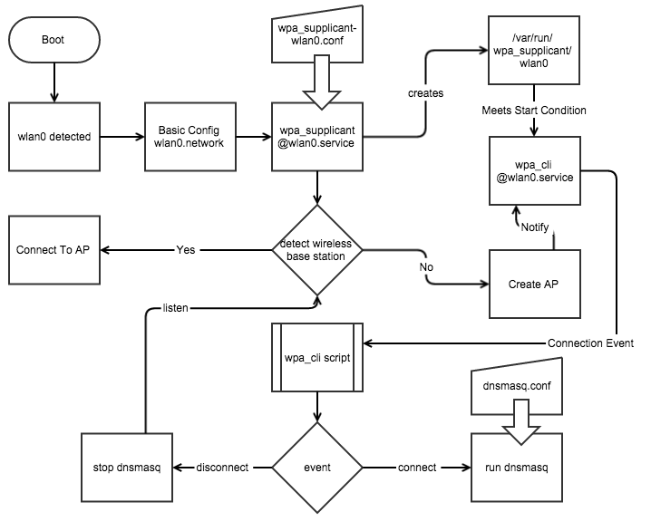

## Prerequisites
```bash
pacman -Syu
pacman -S git
pacman -S iw
pacman -S wpa_supplicant
pacman -S dnsmasq
useradd  -U -m -g a3ot -G wheel a3ot
passwd a3ot
```


## Ruben dependencies

python2 python2-pip


## Wireless
Headless wireless devices are a pain to configure. There are a few options for setting up such a device and each method has its drawbacks.

### 1) connect to the device over a wired network and then configure the wireless via wpa_supplicant for the network that the device will be attached to:
#### PRO:

* the device will be hard coded for the deployed network and should come up automatically on reboot

#### CONS:

* If the network goes down or any problem occurs you cannot access the device with out an Ethernet connection.
* Cant move the device without reconfiguring it for the target network

### 2) setup the device as an access point
#### PRO:

* If the wireless works at all it should be available to connect to.

#### CONS:

* No Internet access for the device (ntp, cloud monitoring etc)
* You always have to disconnect from a wireless network to connect to the device


### 3) by default use a network if available, if not run in access point mode
#### PROS:

* Connect to the Internet if available
* Fallback to AP mode if no Internet

#### CONS:

* non trivial to setup and many fragile scripts usually required.

I've hacked on a way that uses this approach with create_ap and automatically switching networks if one becomes available. [pifi](https://github.com/Quelab/pifi) I find this approach deeply unsatisfying because it uses non standard scripts and can only work with one possible host network.

## A new approach to the Wireless AP Fallback
With a strong desire to move away from non standard shell scripts, I worked on a way to fully utilize systemd units and functionality that I discovered in wpa_supplicant that puts a wireless adapter in AP mode as a network of last resort.

The entire setup uses well known linux networking software and a small script that is called automatically by the wpa_cli daemon when the wireless interface is connected/disconnected in HostAP mode.

### Setup the network interface
Notice the adapter is both listening on 192.168.20.1 as well as DHCP.

*/etc/systemd/network/wlan0.network*
```conf
[Match]
Name=wlan0

[Network]
Address=192.168.20.1/24
DHCP=yes
```

### Setup all known networks including AP mode
* mode=2 refers to the HostAP mode
* networks with higher priorities are selected first

*/etc/wpa_supplicant/wpa_supplicant-wlan0.conf*
```
ctrl_interface=/run/wpa_supplicant
update_config=1

network={
  id_str="site_wireless"
  ssid="site_wireless"
  psk="password"
  priority=1
}

network={
  id_str="cell_phone_wireless"
  ssid="cellular"
  psk="password"
  priority=1
}

network={
  id_str="raspberry"
  ssid="device_ap"
  key_mgmt=WPA-PSK
  psk="password"
  mode=2
  priority=0
}
```


wpa_supplicant@.service

systemctl enable wpa_supplicant@wlan0

### Create the Connect/Disconnect script for hostAP
This script is called automatically on CONNECT/DISCONNECT for any networks including
the ones running in AP mode

```bash
#!/bin/bash

if [ "$WPA_ID_STR" == "raspberry" ]
then
case "$2" in
    CONNECTED)
        systemctl start dnsmasq.service;
        ;;
    DISCONNECTED)
        systemctl stop dnsmasq.service;
        ;;
esac
fi
```

### Configure dnsmasq to handout IP addresses + DNS

*/etc/dnsmasq.conf*
```ini
interface=wlan0
listen-address=127.0.0.1
listen-address=192.168.20.1
bind-interfaces
dhcp-range=192.168.20.50,192.168.20.150,12h
```

### Create a new unit for the wpa_cli
wpa_cli is the daemon that will monitor the network state of various interfaces for wpa_supplicant. It is a bit tricky to get started at the right time with systemd, but I found that starting the service after wpa_supplicant creates the control socket for the wireless interface is the way to go. To listen for the control socket the path unit file was used and tied to the wpa_cli service unit.
Their association happens automatically based on matching file names.

*/usr/lib/systemd/system/wpa_cli\@.path*

```ini
[Path]
PathExists=/var/run/wpa_supplicant/%i
[Install]
WantedBy=default.target
```

*/usr/lib/systemd/system/wpa_cli\@.service*

```ini
[Unit]
Description=WPA CLI
Wants=wpa_supplicant@%i.service sys-subsystem-net-devices-%i.device
After=wpa_supplicant@%i.service sys-subsystem-net-devices-%i.device
ConditionPathExists=/var/run/wpa_supplicant/wlan0

[Service]
ExecStart=/usr/bin/wpa_cli -g /var/run/wpa_supplicant/%i -a /home/a3ot/start_dnsmasq.sh

[Install]
WantedBy=default.target
```
### Restart Wireless once an hour for flaky AP and networking cards
Since All of the configuration scripts are using templates it is necessary to create a target file to trigger installation

*restart_wpa_supplicant.target*
```ini
[Unit]
Description=A target required for wpa_supplicant restart service install
```

*restart_wpa_supplicant@.service*
```ini
[Unit]
Description=WPA supplicant daemon restarter (interface-specific version)
Requires=wpa_supplicant@%i.service
After=wpa_supplicant@%i.service

[Service]
Type=oneshot
ExecStart=/usr/bin/systemctl restart wpa_supplicant@%i.service
Restart=no

[Install]
WantedBy=restart_wpa_supplicant.target
```

*restart_wpa_supplicant@.timer*
```ini
[Unit]
Description=Restarts WPA supplicant every hour

[Timer]
# Time to wait after booting before we run first time
OnBootSec=10min
# Time between running each consecutive time
OnUnitActiveSec=1h
Unit=restart_wpa_supplicant@%i.service

[Install]
WantedBy=multi-user.target
```

MAC 7c:dd:90:7e:57:9d

